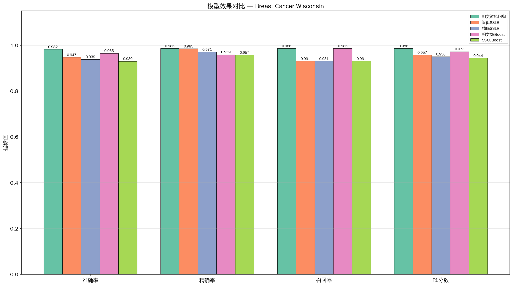
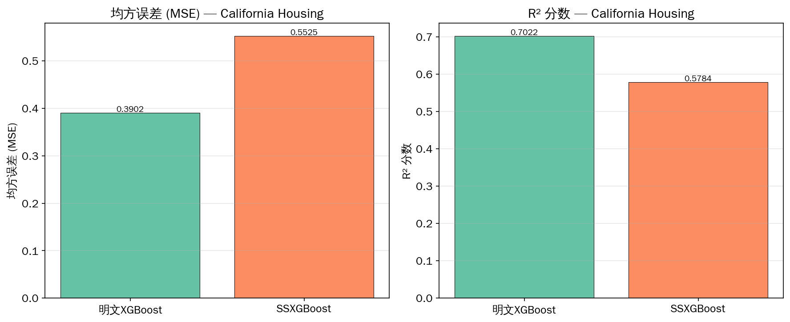
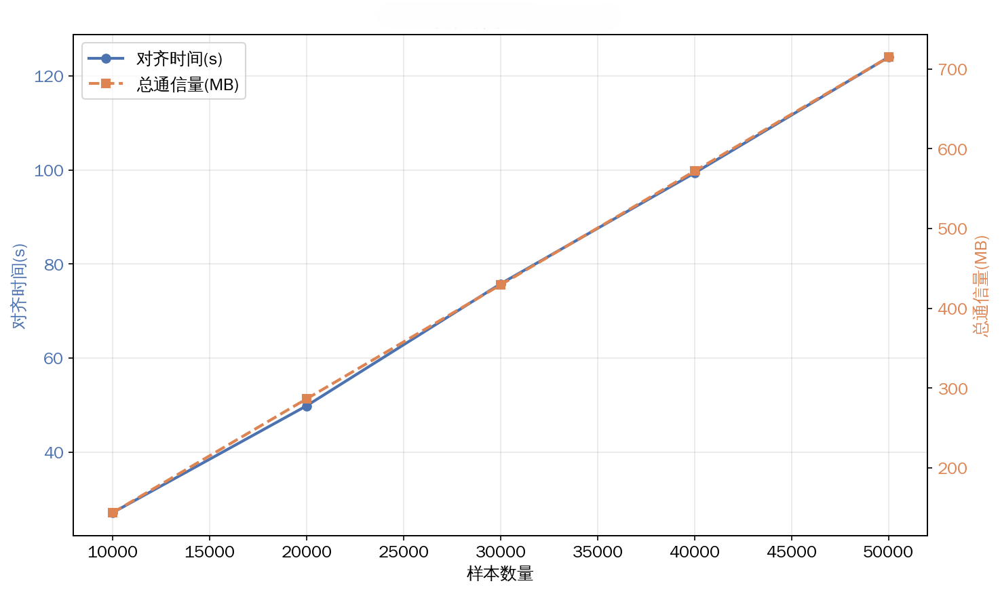
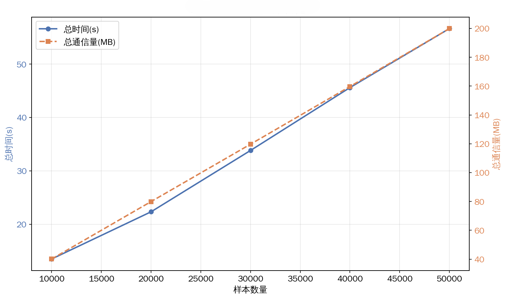
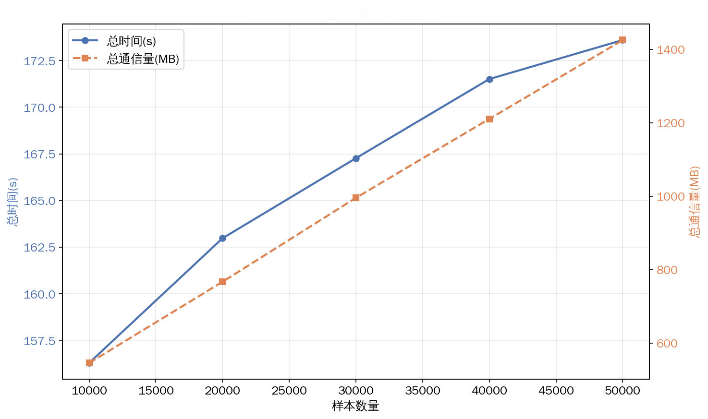
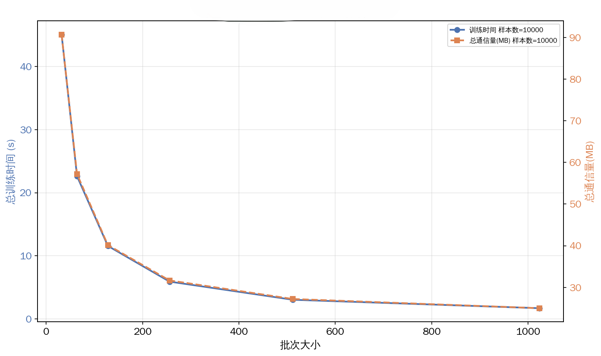
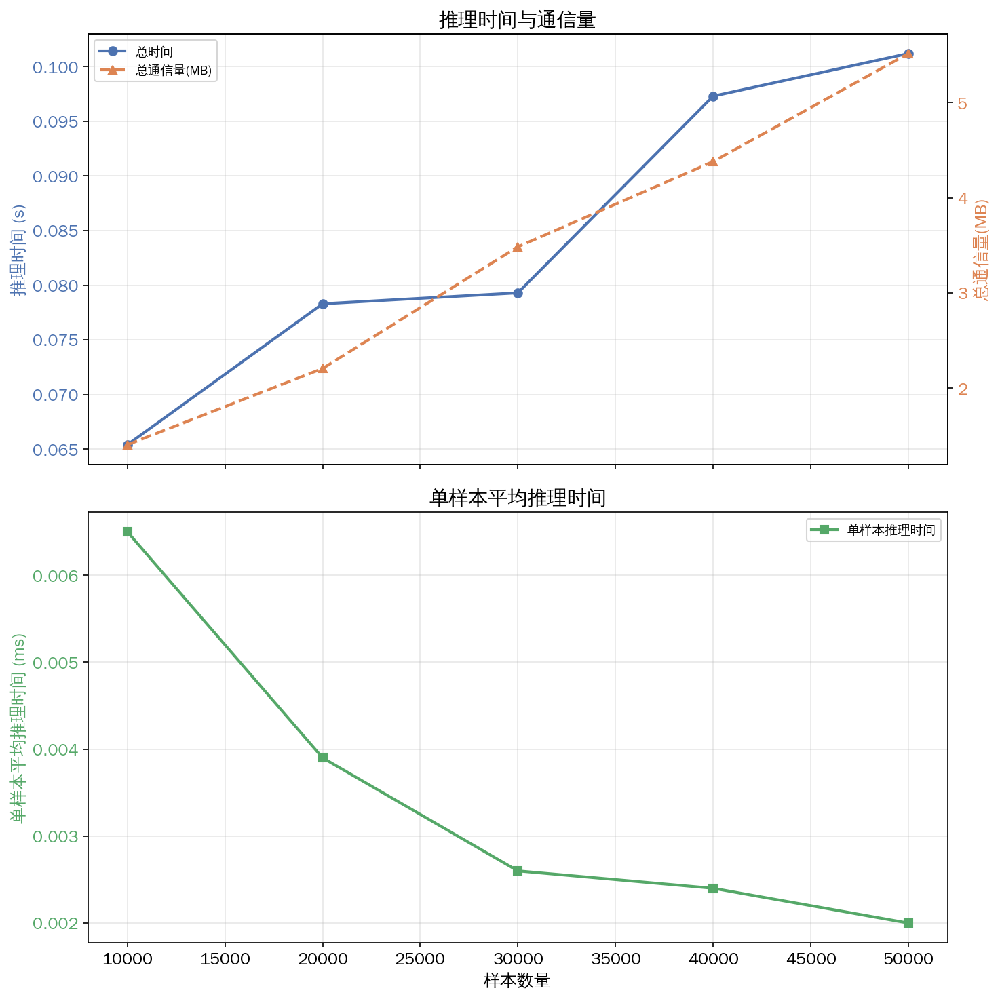
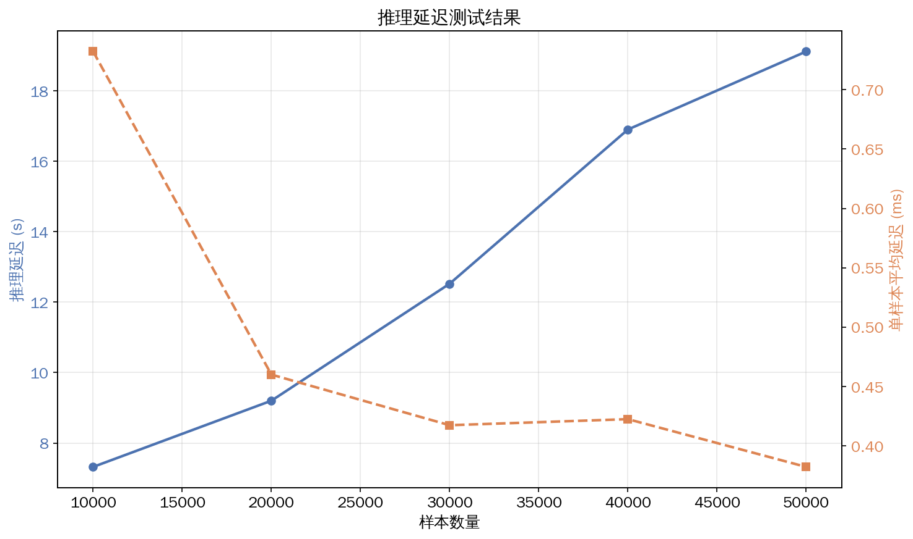
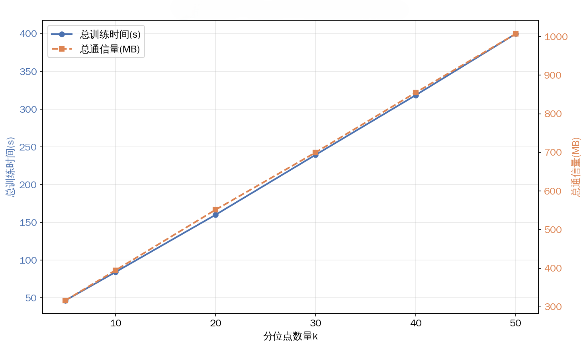

# AnonymVFL — test 分支

本分支为 AnonymVFL 项目的**实验/测试分支**，用于进行模型效果评估与性能基准测试。

## 项目简介

AnonymVFL 是一个基于 [SecretFlow](https://github.com/secretflow/secretflow) 的**安全纵向联邦学习**框架，支持的模型包括：

- **SSLR**（Secret-Shared Logistic Regression）：秘密共享逻辑回归，支持近似/精确 sigmoid
- **SSXGBoost**（Secret-Shared XGBoost）：秘密共享梯度提升树，支持分位点分桶

运行模式：
- `single_sim`：单机仿真，用于模型效果测试
- `multi_distributed`：两机分布式，用于性能/通信测试

---

## 实验总览

| 类别 | 目的 | 数据集 | 模式 |
|------|------|--------|------|
| 模型效果评估 | 对比安全训练与明文基线的模型质量 | Breast Cancer、California Housing、Gisette、Adult | single_sim |
| 性能基准 | 测量训练/推理的耗时、通信量、可扩展性 | 合成数据（Online Shoppers 特征） | multi_distributed |
| WAN 网络影响 | 模拟带宽/延迟约束下的性能变化 | 合成数据 | multi_distributed + tc/netem |
| 压力测试 | 验证大规模样本下的系统稳定性 | 合成数据（60万/100万） | multi_distributed |
| 分布式对比 | SSLR/SSXGBoost 在不同数据集/参数下的对比 | MNIST (二分类)、Adult、合成数据 | multi_distributed |

---

## 1. 模型效果评估

> 运行模式: `single_sim`，无需分布式环境
> 测试代码：[tests/test_model_eval.py](tests/test_model_eval.py)

### 实验设定

- 数据划分：样本按 8:1:1 分为训练集、Company 独有集、Partner 独有集，独有集合作为验证集；特征纵向对半分配
- 分类指标：Accuracy、Precision、Recall、F1
- 回归指标：MSE、R²
- 基线：sklearn LogisticRegression、XGBClassifier/XGBRegressor

### 实验结果

**Breast Cancer Wisconsin（二分类）：**

明文逻辑回归达到最高准确率 97.37%；安全训练方案中 SSXGBoost 最优（92.98%），近似 SSLR 次之（92.11%），精确 SSLR 略低（91.23%）。安全训练的精度损失约 4-5 个百分点，在纵向联邦场景中可接受；精确 sigmoid 在 MPC 下数值误差略大，近似版本反而更稳定。

- 汇总对比: [cancer_comparison.csv](test_results/model_eval/cancer_comparison.csv)
- 各方法详细指标: [approx_sslr_cancer_metrics.csv](test_results/model_eval/approx_sslr_cancer_metrics.csv) · [exact_sslr_cancer_metrics.csv](test_results/model_eval/exact_sslr_cancer_metrics.csv) · [ssxgboost_cancer_metrics.csv](test_results/model_eval/ssxgboost_cancer_metrics.csv) · [sklearn_lr_cancer_metrics.csv](test_results/model_eval/sklearn_lr_cancer_metrics.csv) · [sklearn_xgb_cancer_metrics.csv](test_results/model_eval/sklearn_xgb_cancer_metrics.csv)
- 训练曲线: [approx_sslr_cancer_curve.png](test_results/model_eval/approx_sslr_cancer_curve.png) · [exact_sslr_cancer_curve.png](test_results/model_eval/exact_sslr_cancer_curve.png) · [ssxgboost_cancer_curve.png](test_results/model_eval/ssxgboost_cancer_curve.png)

**California Housing（回归）：**

SSXGBoost 的 MSE 为 0.55（R²=0.58），略逊于明文 XGBoost 的 MSE 0.39（R²=0.70）。安全训练保留了约 83% 的明文回归能力，MPC 下的分位点分桶和梯度量化引入了一定信息损失。

- 汇总对比: [housing_comparison.csv](test_results/model_eval/housing_comparison.csv)
- 详细指标: [ssxgboost_housing_metrics.csv](test_results/model_eval/ssxgboost_housing_metrics.csv) · [ssxgboost_housing_intersection_quantize_metrics.csv](test_results/model_eval/ssxgboost_housing_intersection_quantize_metrics.csv) · [sklearn_xgb_housing_metrics.csv](test_results/model_eval/sklearn_xgb_housing_metrics.csv)

**Gisette（二分类）：**

近似 SSLR 准确率 94.29%，训练过程中最高准确率达 97.57%。在高维稀疏数据上 SSLR 表现良好，但泛化存在一定波动，验证集与训练集最优存在约 3 个百分点的差距。

- [approx_sslr_gisette_metrics.csv](test_results/model_eval/approx_sslr_gisette_metrics.csv)

**Adult（二分类）：**

SSXGBoost 在 depth=3/4/5 下准确率分别为 84.00%/83.91%/84.29%。加深树深度对精度提升有限（仅 0.29%），但训练时间和通信量却呈指数增长（depth=5 是 depth=3 的 4 倍），说明 SSXGBoost 在 depth=3 时性价比最高。

- [ssxgboost_adult_depth3_metrics.csv](test_results/model_eval/ssxgboost_adult_depth3_metrics.csv) · [ssxgboost_adult_depth4_metrics.csv](test_results/model_eval/ssxgboost_adult_depth4_metrics.csv) · [ssxgboost_adult_depth5_metrics.csv](test_results/model_eval/ssxgboost_adult_depth5_metrics.csv)

---

## 2. 性能基准测试

> 运行模式: `multi_distributed`，需要两机 Ray 集群（配置文件: [tests/distributed_config.yaml](tests/distributed_config.yaml)）
> 数据集: 合成数据，18 维特征
> 测试代码: [tests/test_performance.py](tests/test_performance.py)

### 2.1 可扩展性测试（10K–50K 样本）

**PSI 对齐：** 时间从 27s（1万）增长到 124s（5万），通信量从 143 MB 增长到 715 MB，近似线性。PSI 耗时主要由 HEU 加密和网络传输决定，在 5 万样本内扩展性良好。

- [psi_scalability.csv](test_results/performance/psi_scalability.csv)

**SSLR 训练（3 epochs, batch_size=128）：** 时间从 13.5s（1万）增长到 56.7s（5万），通信量从 40 MB 增长到 200 MB，近似线性。SSLR 在 MPC 下仅需矩阵乘法和 sigmoid 近似，计算开销较低，适合大规模样本在线训练。

- [sslr_scalability.csv](test_results/performance/sslr_scalability.csv)

**SSXGBoost 训练（3 estimators, depth=3）：** 时间从 156s（1万）增长到 174s（5万），通信量从 546 MB 增长到 1425 MB。SSXGBoost 是三种操作中最耗时的，但其时间随样本量增长缓慢——MPC 中的分桶和分裂点搜索固定开销占主导，数据量增大主要影响通信而非计算。

- [xgboost_scalability.csv](test_results/performance/xgboost_scalability.csv)

### 2.2 Batch Size 影响（SSLR, 1万样本）

增大 batch size 显著降低训练时间：batch_size=1024 仅需 1.68s，比 batch_size=32 的 45.09s 快约 27 倍。通信量也从 91 MB 降至 25 MB。大 batch 减少了 MPC 交互轮数，同时梯度聚合的通信开销被更多样本摊薄，两者叠加带来超线性加速效果。

- [batch_size_impact.csv](test_results/performance/batch_size_impact.csv)

### 2.3 推理延迟

**SSLR 推理：** 5万样本仅需 0.10s，单样本延迟约 2 μs，通信量仅 5.5 MB。SSLR 推理在 MPC 下极为高效——仅需一次矩阵乘法即可完成预测，延迟可忽略不计，适合实时在线推理场景。

- [lr_inference_latency.csv](test_results/performance/lr_inference_latency.csv)

**SSXGBoost 推理：** 5万样本需 19.1s，单样本延迟约 0.38ms，通信量约 94 MB。SSXGBoost 推理需要在 MPC 中逐棵树遍历，延迟比 SSLR 高约两个数量级，但仍在可接受范围内（单样本 < 1ms）。

- [xgboost_inference_latency.csv](test_results/performance/xgboost_inference_latency.csv)

### 2.4 分位点数量 k 的影响（SSXGBoost, 1万样本）

分位点 k 从 5 增大到 50，训练时间从 46.6s 增长到 400s，通信量从 316 MB 增长到 1007 MB。k 与训练成本近似线性关系，每个分位点额外引入一次秘密比较和分桶操作；k=20 在精度和效率之间取得较好平衡。

- [quantile_impact.csv](test_results/performance/quantile_impact.csv)

---

## 3. WAN 网络影响测试

> 使用 `tc/netem` 模拟带宽（10–50 Mb/s）和延迟（0–50ms），需要 sudo 权限
> 测试代码: [tests/test_performance.py](tests/test_performance.py) · [tests/wan_setup.sh](tests/wan_setup.sh)

### 实验结果

**延迟是主要瓶颈。** 以 SSLR 为例：10 Mb/s 带宽下仅需 28.4s，而 10ms 延迟需 77.8s，50ms 延迟则膨胀到 359.6s。带宽从 10 Mb/s 提升到 50 Mb/s 仅减少约一半时间，而延迟从 0ms 增加到 50ms 放大近 27 倍。这是因为 MPC 协议（SEMI2K）依赖大量同步交互轮次，每轮都受网络 RTT 的串行累积影响，因此低延迟网络对安全联邦学习至关重要。

PSI 和 SSXGBoost 呈现相似趋势，SSXGBoost 受延迟影响最大（50ms 延迟下耗时超 1 小时，延迟放大近 19 倍），因其单轮训练涉及更多轮次的秘密比较和聚合操作。

- 训练 WAN 影响 + 图: [sslr_network_impact_wan.png](test_results/performance/sslr_network_impact_wan.png) · [sslr_network_impact_wan.csv](test_results/performance/sslr_network_impact_wan.csv)
- PSI WAN: [psi_network_impact_wan.png](test_results/performance/psi_network_impact_wan.png) · [psi_network_impact_wan.csv](test_results/performance/psi_network_impact_wan.csv)
- SSXGBoost WAN: [xgboost_network_impact_wan.png](test_results/performance/xgboost_network_impact_wan.png) · [xgboost_network_impact_wan.csv](test_results/performance/xgboost_network_impact_wan.csv)
- 推理 WAN: [sslr_inference_wan.png](test_results/performance/sslr_inference_wan.png) · [sslr_inference_wan.csv](test_results/performance/sslr_inference_wan.csv) / [xgboost_inference_wan.png](test_results/performance/xgboost_inference_wan.png) · [xgboost_inference_wan.csv](test_results/performance/xgboost_inference_wan.csv)

---

## 4. 压力测试

> 默认 1000 万样本且仅测 PSI，需修改脚本中的 `STRESS_SAMPLES`、`STRESS_TEST_FILTER` 变量来调整样本量或测试项（实测使用 60 万和 100 万样本，依次跑过 PSI/SSLR/SSXGBoost）
> 测试代码: [tests/test_performance.py](tests/test_performance.py) · [tests/stress_setup.sh](tests/stress_setup.sh)

| 测试 | 60万样本 | 100万样本 |
|------|---------|----------|
| PSI 对齐 | 1532s (~25min), 8.9 GB | 2599s (~43min), 14.8 GB |
| SSLR 训练 | 881s (~15min), 2.1 GB | 1583s (~26min), 4.0 GB |
| SSXGBoost 训练 | 999s (~17min), 14.6 GB | 1769s (~29min), 27.9 GB |

PSI 在大规模下成为主要瓶颈——100 万样本的 PSI 耗时超过 SSLR 和 SSXGBoost 之和，通信量也远超训练阶段。系统在百万级样本下运行稳定，但 PSI 的内存峰值达 38 GB，实际部署时需为 HEU 密文分配充足内存。

- [psi_stress.csv](test_results/performance/psi_stress.csv) · [sslr_stress.csv](test_results/performance/sslr_stress.csv) · [xgboost_stress.csv](test_results/performance/xgboost_stress.csv)

---

## 5. 分布式对比测试

> 测试代码: [tests/test_compare.py](tests/test_compare.py)

| 实验 | 数据集 | 参数 | 最优 ACC | 训练时间 | 总通信量 |
|------|--------|------|----------|----------|----------|
| SSLR | MNIST 二分类 | epoch=2, bs=128 | 97.82% | ~137s | ~2.4 GB |
| SSXGBoost | Adult | depth=3 | 84.00% | 217s | 1.7 GB |
| SSXGBoost | Adult | depth=4 | 83.91% | 446s | 3.5 GB |
| SSXGBoost | Adult | depth=5 | 84.29% | 900s | 6.9 GB |
| SSLR 通信量 | 合成数据 | dim=100/500/1000 | — | — | 59–377 MB |

SSLR 在 MNIST 上达到 97.82% 准确率，接近明文水平，验证了安全逻辑回归在图像二分类场景的有效性。SSLR 通信量与特征维度呈线性增长（dim=1000 时 377 MB），梯度矩阵的维度决定了每轮交互的数据量。

- [compare_results.csv](test_results/performance/compare_results.csv) · [sslr_comm_by_dimension.csv](test_results/performance/sslr_comm_by_dimension.csv)

---

## 结果文件索引

### 模型评估 (`test_results/model_eval/`)

| 文件 | 说明 |
|------|------|
| [cancer_comparison.csv](test_results/model_eval/cancer_comparison.csv) | 所有方法在 Breast Cancer 上的汇总对比 |
| [cancer_comparison.png](test_results/model_eval/cancer_comparison.png) | |
| [approx_sslr_cancer_metrics.csv](test_results/model_eval/approx_sslr_cancer_metrics.csv) | 近似 SSLR 详细分类指标 |
| [approx_sslr_cancer_curve.png](test_results/model_eval/approx_sslr_cancer_curve.png) | 近似 SSLR 训练曲线 |
| [exact_sslr_cancer_metrics.csv](test_results/model_eval/exact_sslr_cancer_metrics.csv) | 精确 SSLR 详细分类指标 |
| [exact_sslr_cancer_curve.png](test_results/model_eval/exact_sslr_cancer_curve.png) | 精确 SSLR 训练曲线 |
| [ssxgboost_cancer_metrics.csv](test_results/model_eval/ssxgboost_cancer_metrics.csv) | SSXGBoost 详细分类指标 |
| [ssxgboost_cancer_curve.png](test_results/model_eval/ssxgboost_cancer_curve.png) | SSXGBoost 训练曲线 |
| [sklearn_lr_cancer_metrics.csv](test_results/model_eval/sklearn_lr_cancer_metrics.csv) | sklearn 逻辑回归基线 |
| [sklearn_xgb_cancer_metrics.csv](test_results/model_eval/sklearn_xgb_cancer_metrics.csv) | sklearn XGBoost 基线 (cancer) |
| [housing_comparison.csv](test_results/model_eval/housing_comparison.csv) | Housing 回归汇总对比 |
| [housing_comparison.png](test_results/model_eval/housing_comparison.png) | |
| [ssxgboost_housing_metrics.csv](test_results/model_eval/ssxgboost_housing_metrics.csv) | SSXGBoost Housing 回归指标 |
| [ssxgboost_housing_intersection_quantize_metrics.csv](test_results/model_eval/ssxgboost_housing_intersection_quantize_metrics.csv) | SSXGBoost Housing (intersection quantize 变体) |
| [sklearn_xgb_housing_metrics.csv](test_results/model_eval/sklearn_xgb_housing_metrics.csv) | sklearn XGBoost 基线 (housing) |
| [approx_sslr_gisette_metrics.csv](test_results/model_eval/approx_sslr_gisette_metrics.csv) | 近似 SSLR 在 Gisette 上的指标 |
| [ssxgboost_adult_depth3_metrics.csv](test_results/model_eval/ssxgboost_adult_depth3_metrics.csv) | SSXGBoost Adult depth=3 |
| [ssxgboost_adult_depth4_metrics.csv](test_results/model_eval/ssxgboost_adult_depth4_metrics.csv) | SSXGBoost Adult depth=4 |
| [ssxgboost_adult_depth5_metrics.csv](test_results/model_eval/ssxgboost_adult_depth5_metrics.csv) | SSXGBoost Adult depth=5 |

### 性能测试 (`test_results/performance/`)

| 文件 | 说明 |
|------|------|
| [psi_scalability.csv](test_results/performance/psi_scalability.csv) | PSI 可扩展性 |
| [psi_scalability.png](test_results/performance/psi_scalability.png) | |
| [sslr_scalability.csv](test_results/performance/sslr_scalability.csv) | SSLR 可扩展性 |
| [sslr_scalability.png](test_results/performance/sslr_scalability.png) | |
| [xgboost_scalability.csv](test_results/performance/xgboost_scalability.csv) | SSXGBoost 可扩展性 |
| [xgboost_scalability.png](test_results/performance/xgboost_scalability.png) | |
| [batch_size_impact.csv](test_results/performance/batch_size_impact.csv) | Batch Size 影响 |
| [batch_size_impact.png](test_results/performance/batch_size_impact.png) | |
| [lr_inference_latency.csv](test_results/performance/lr_inference_latency.csv) | SSLR 推理延迟 |
| [lr_inference_latency.png](test_results/performance/lr_inference_latency.png) | |
| [xgboost_inference_latency.csv](test_results/performance/xgboost_inference_latency.csv) | SSXGBoost 推理延迟 |
| [xgboost_inference_latency.png](test_results/performance/xgboost_inference_latency.png) | |
| [quantile_impact.csv](test_results/performance/quantile_impact.csv) | 分位点 k 影响 |
| [quantile_impact.png](test_results/performance/quantile_impact.png) | |
| [psi_network_impact_wan.csv](test_results/performance/psi_network_impact_wan.csv) | PSI WAN 网络影响 |
| [psi_network_impact_wan.png](test_results/performance/psi_network_impact_wan.png) | |
| [sslr_network_impact_wan.csv](test_results/performance/sslr_network_impact_wan.csv) | SSLR WAN 网络影响 |
| [sslr_network_impact_wan.png](test_results/performance/sslr_network_impact_wan.png) | |
| [xgboost_network_impact_wan.csv](test_results/performance/xgboost_network_impact_wan.csv) | SSXGBoost WAN 网络影响 |
| [xgboost_network_impact_wan.png](test_results/performance/xgboost_network_impact_wan.png) | |
| [sslr_inference_wan.csv](test_results/performance/sslr_inference_wan.csv) | SSLR 推理 WAN 影响 |
| [sslr_inference_wan.png](test_results/performance/sslr_inference_wan.png) | |
| [xgboost_inference_wan.csv](test_results/performance/xgboost_inference_wan.csv) | SSXGBoost 推理 WAN 影响 |
| [xgboost_inference_wan.png](test_results/performance/xgboost_inference_wan.png) | |
| [psi_stress.csv](test_results/performance/psi_stress.csv) | PSI 压力测试 |
| [sslr_stress.csv](test_results/performance/sslr_stress.csv) | SSLR 压力测试 |
| [xgboost_stress.csv](test_results/performance/xgboost_stress.csv) | SSXGBoost 压力测试 |
| [compare_results.csv](test_results/performance/compare_results.csv) | 分布式对比结果 |
| [sslr_comm_by_dimension.csv](test_results/performance/sslr_comm_by_dimension.csv) | SSLR 通信量 vs 特征维度 |

### 测试脚本及配置

| 文件 | 说明 |
|------|------|
| [tests/test_model_eval.py](tests/test_model_eval.py) | 模型效果评估测试 |
| [tests/test_performance.py](tests/test_performance.py) | 性能基准测试 |
| [tests/test_compare.py](tests/test_compare.py) | 分布式对比测试 |
| [tests/plot_utils.py](tests/plot_utils.py) | 图表绘制工具 |
| [tests/redraw_plots.py](tests/redraw_plots.py) | 从 CSV 重新生成所有图表 |
| [tests/conftest.py](tests/conftest.py) | Pytest 共享 fixtures |
| [tests/distributed_config.yaml](tests/distributed_config.yaml) | 两机分布式配置 |
| [tests/scalability_setup.sh](tests/scalability_setup.sh) | 一键可扩展性测试 |
| [tests/wan_setup.sh](tests/wan_setup.sh) | 一键 WAN 网络测试 |
| [tests/stress_setup.sh](tests/stress_setup.sh) | 一键压力测试 |
| [tests/auto_stress.sh](tests/auto_stress.sh) | WAN 测试后自动串联压力测试 |
| [tests/start_ray_head.sh](tests/start_ray_head.sh) | 启动 Ray Head |
| [tests/start_partner_worker.sh](tests/start_partner_worker.sh) | 启动 Partner Worker |
| [pytest.ini](pytest.ini) | Pytest 配置与 markers |
| [requirements.txt](requirements.txt) / [requirements-lock.txt](requirements-lock.txt) | Python 依赖 |
| [setup_env.sh](setup_env.sh) | 环境安装脚本 |
